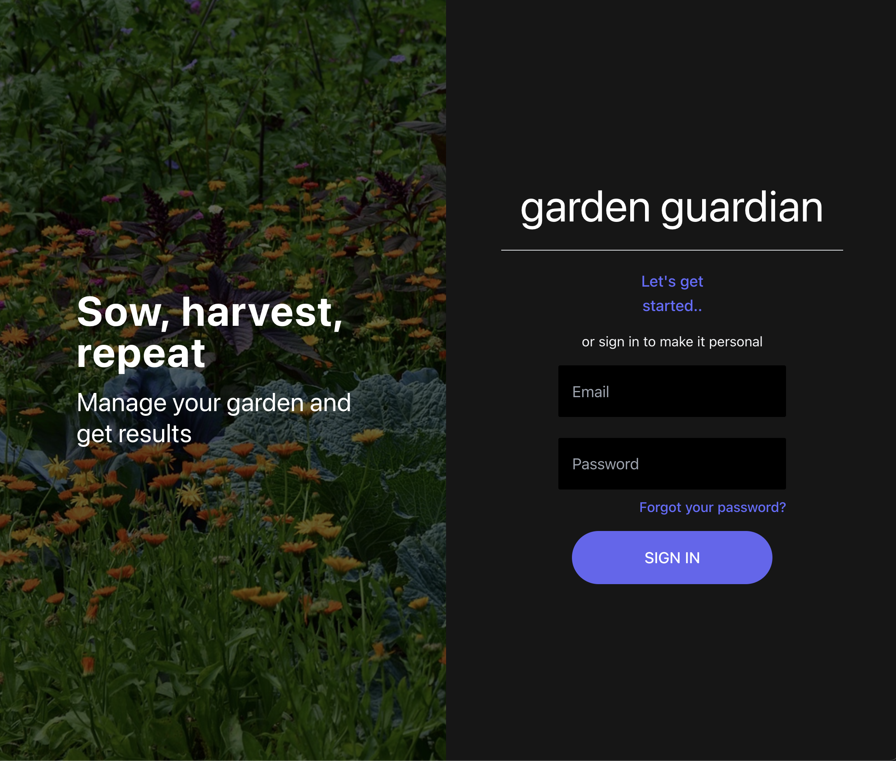
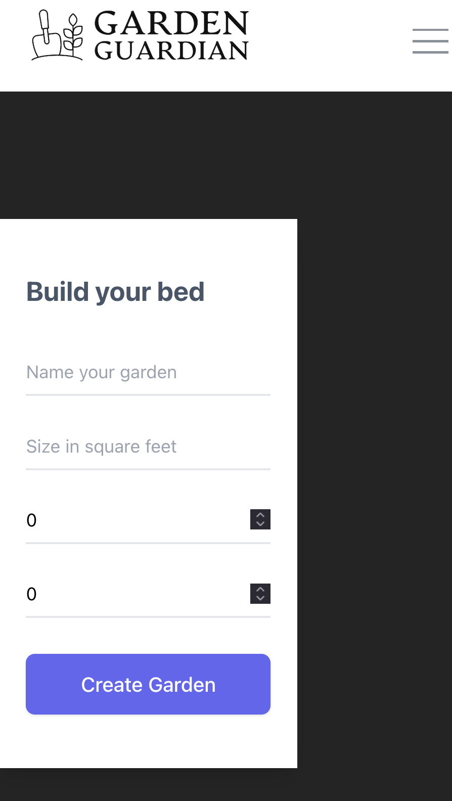
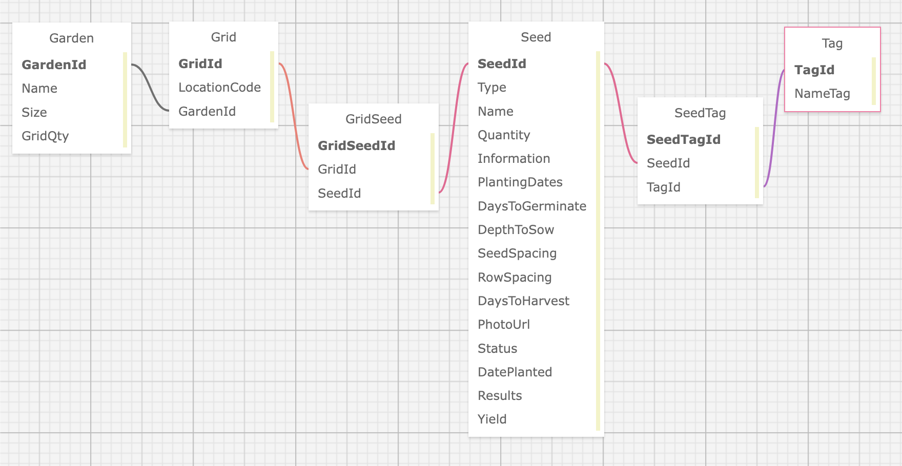
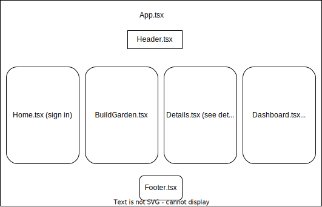

<p align="center">
  <big><b>Garden Guardian</b></big>
</p>

#### An application to track your gardening process and results over time



<p align="center">
  by <a href="https://github.com/kimmykokonut"><strong>kimmykokonut</strong></a>
</p>
<p align="center">
        <a href="https://github.com/kimmykokonut/Garden-guardian/stargazers">
            
        </a>
        ¨
        <a href="https://github.com/kimmykokonut/Garden-guardian/issues">
            
        </a>
        ¨
        <a href="https://github.com/kimmykokonut/Garden-guardian/blob/main/LICENSE">
            
        </a>
        ¨
        <a href="https://www.linkedin.com/in/robinson-kim/">
            
        </a>
    </p>    
</p>

---------------------
### <u>Jump to section</u>
* <a href="#about-the-project">About the Project</a>
  * <a href="#description">Description</a>
  * <a href="#built-with">Built With</a>
  * <a href="#known-bugs">Known Bugs</a>
* <a href="#getting-started">Getting Started</a>
  * <a href="#prerequisites">Prerequisites</a>
  * <a href="#setup">Setup</a>
  * <a href="#api-documentation">API Documention</a>
* <a href="#setup-client-side">Setup Client Side</a>
* <a href="#stretch-goals">Stretch Goals</a>
* <a href="#license">License</a>
  * <a href="#acknowledgements">Acknowledgements</a>

------------------------------
## About the Project
Inspired by my unfinished team week project during my time at Epicodus, [Garden Tracker](https://github.com/kimmykokonut/GardenTracker), my goals were lofty: to build out the relationships in the database, switch the database from MySQL to PostgreSQL and switch our barely started UI from Preact to React, adding Typescript, and style with Tailwind.  Hosted on Supabase

### Description
An API that functions as a garden database where a user can create, read, update and delete garden beds and seeds. The user can add grids to the bed and plant seeds in the grids.  The user is able to see the in-use version of the API using Postman or Swagger, or explore the API via the user interface, which is a work in progress.



### Built With
* Typescript
* Javascript
* React
* Tailwind CSS
* PostgreSQL
* C# ASP.NET EF Core WebApi
* Visual Studio Code
* Git
* Swagger
* Postman
* Entity Framework Core

### Known Bugs
* Disable Plant button once a seed is planted to the grid
* Bug at home page full computer screen width, responsive at all other sizes
* Want create bed form to be centered at full screen width
* Issue with content overflowing header

## Getting Started

### Prerequisites
#### Install .NET Core
* On macOS Mojave or later
  * [Click here](https://dotnet.microsoft.com/download/thank-you/dotnet-sdk-2.2.106-macos-x64-installer) to download the .NET Core SDK from Microsoft Corp for macOS.
* On Windows 10 x64 or later
  * [Click here](https://dotnet.microsoft.com/download/thank-you/dotnet-sdk-2.2.203-windows-x64-installer) to download the 64-bit .NET Core SDK from Microsoft Corp for Windows.

#### Install dotnet script
 Enter the command ``dotnet tool install -g dotnet-script`` in Terminal for macOS or PowerShell for Windows.

#### Install PostgreSQL
 * [Download and install PostgreSQL](https://www.postgresql.org/download/)

#### Install Postman
(Optional) [Download and install Postman](https://www.postman.com/downloads/).

#### Code Editor
  To view or edit the code, you will need a code editor or text editor. The open-source code editor I used is VisualStudio Code.

  1) Code Editor Download: [VisualStudio Code](https://www.npmjs.com/)
  2) Click the download most applicable to your OS and system.
  3) Wait for download to complete, then install -- Windows will run the setup exe and macOS will drag and drop into applications.

### Setup
#### Cloning
1. Navigate to the [repository](https://github.com/kimmykokonut/Garden-guardian).

  2. Click the `Fork` button and  you will be taken to a new page where you can give your repository a new name and description. Choose "create fork".

3. Click the `Code` button and copy the url for HTTPS.

4. On your local computer, create a working directory of your choice.

5. In this new directory, via the terminal, type `$ git clone https://github.com/kimmykokonut/Garden-guardian`.

6. Run the command `cd Garden-guardian` to enter into the project directory.

7. Once you have this on your local directory, if you ever want to push it to GitHub, you need to do these steps first so Git knows to ignore the desired directories and files:
`$ git init` to initialize Git and
`$ touch .gitignore` adds .gitignore file in the root directory. (if cloning, this step already automatically happened, it is good practice to double check.)

8. View or Edit: On your terminal, type `$ code .` to open the project in VS Code.

9.  Ensure the .gitignore file contains:
```
> bin
> obj
> appsettings.json
```
Once confirmed, ensure sensitive files are not shared to GitHub by commiting .gitignore file before appsettings.json is created. Via terminal:
```
$ git add .gitignore
$ git commit -m 'add .gitignore'
$ git push origin main
```
#### Protect DB Connection string with appsettings.json

  1) Create a new file in the root directory named `appsettings.json`
  2) Add in the following code snippet to the new appsettings.json file, replacing the following with your own:
  ```
    [YOUR-USERNAME] with your username
    [YOUR-PASSWORD] with your PostgreSql password
    [YOUR-DB-NAME] with the name of your database
  ```

  appsettings.json
  ```
  {
  "Logging": {
    "LogLevel": {
      "Default": "Information",
      "Microsoft.AspNetCore": "Warning"
    }
  },
  "AllowedHosts": "*",
  "ConnectionStrings": {
    "DefaultConnection": "User Id=[YOUR-USERNAME];Password=[YOUR-PASSWORD];Server=localhost;Port=5432;Database=[YOUR-DB-NAME];"
  }
}
  ```
 #### Log info that is relevant to ASP.NET Core and EF Core in appsettings.Development.json

 1) Create a new file in the root directory named `appsettings.Development.json`
  2) Add in the following code snippet to this file:
```
{
  "Logging": {
    "LogLevel": {
      "Default": "Information",
      "Microsoft": "Trace",
      "Microsoft.AspNetCore": "Information",
      "Microsoft.Hosting.Lifetime": "Information"
    }
  }
}
```
#### ...Back to VSCode's Terminal...
 While in the terminal, navigate to the project's production directory and type `$ dotnet build` to compile the application's code and install all needed dependencies (this creates the bin folder).  Type `$ dotnet restore` to create the obj folder.

#### Database
  We will use migrations to create a new database based on our code. 
1. Install dotnet ef globally (if not already installed)
`$ dotnet tool install --global dotnet-ef --version 6.0.0`
2.  If you need to make any changes to the Models or their properties, do it now, this next step will create your database based on that data.
3. Create a migration now (and any time you change your Models) (name = Initial for your first migration, then a descriptive name for future migrations):
`$ dotnet ef migrations add <MigrationName>`
5. Update the database with the migrations:
`$ dotnet ef database update`
6. IF you make a mistake and haven't pushed the changes to GitHub you can revert the last migration
`$ dotnet ef migrations remove`
* You can also manually check on the database easily through the terminal, learn more [here](https://www.postgresql.org/docs/current/app-psql.html). 

#### Launch the API
1) Navigate to GardenGuardian directory using the MacOS Terminal or Windows Powershell.
2) Run the command `dotnet run` to have access to the API in Postman or browser via swagger `http://localhost:5000/swagger/index.html`.
3) You can close the server at anytime by entering `ctrl` + `c` in the terminal. 

### API Documention
Explore the API endpoints in Postman or a browser.

### Database relationships


### Using Swagger Documentation 
To explore with Swagger, launch the project using `dotnet run` with the Terminal or Powershell, and input the following URL into your browser: `http://localhost:5000/swagger`

#### Example Query
```
https://localhost:5000/api/Gardens
```
.............................................................

### Endpoints
Base URL: `https://localhost:5000`

#### HTTP Request Structure
```
GET /api//{component}  
POST /api/{component}  
GET /api/{component}/{id} 
PUT /api/{component}/{id} 
DELETE /api/{component}/{id} 
```

#### Example Query
```
https://localhost:5000/api/Gardens/1
```

#### Sample JSON Response
```
{
  "gardenId": 1,
  "name": "Backyard SE",
  "size": "12sqft",
  "row": 3,
  "column": 4
}
```
...........................................................

### Gardens
Access information on garden beds.

#### HTTP Request
```
GET /api/Gardens   | Gets list of Gardens in database
POST /api/Gardens   | Creates new garden object
GET /api/Gardens/{id}   | Gets garden by id number
PUT /api/Gardens/{id}   | Edits entire garden object
DELETE /api/gardens/{id}   | Deletes garden object by id
```

#### Path Parameters
| Parameter | Type | Default | Required | Description |
| :---: | :---: | :---: | :---: | --- |
| name | string | none | true | Return matches by name.
| size | string | none | true | Return gardens based on size. |

#### Example Query
```
https://localhost:5000/api/Gardens/?name=SE
```

#### Sample JSON Response
```
{
  "gardenId": 1,
  "name": "Backyard SE",
  "size": "12sqft",
  "row": 3,
  "column": 4
}
```
#### Example Post Action to add a garden to the database
POST request to:
```
http://localhost:5000/api/Gardens
```
with an object literal in the body of the API call: (Never include a gardenId property, that value is set by the database)
```
{
  "name": "Front yard NE",
  "size": "16 sq ft",
  "row": 4,
  "column": 4
}
```
---------------------------------
### Front End UI is in progress 

#### Setup Client Side
1. Once in VS Code, open the terminal there and type `$ npm install` (to install the packages and dependencies).
2. To launch the dev server, run $ npm run dev then `$ o + enter` or click the link in the terminal.

* Current functionality:
-user can create a garden bed, grids are linked at creation
-user can add seeds to garden grids
-user can create new seed object
-user can see garden details
-user can see seed details

#### React Component diagram


### Stretch Goals
* Create seed form done, need to make functional and route to seed detail page.
* AddTag to Seed on UI
* SeedDetail page-wip
* GardenDetail page: show seeds attached to each grid (build in api call for gridId detail)
* User authentication & roles
* Add edit/delete for Garden, Grid, Seed 
* Finish styling site

### License
MIT License, see license.md for more information

### Acknowledgements
Thanks to my Epicodus team for the kickstart to get this project started and digging deep into the API together. Gabriel Tucker, Nikkita Torres, Chris Davila Ross

todo:
--update api to search query by name for .includes
--deploy, add link